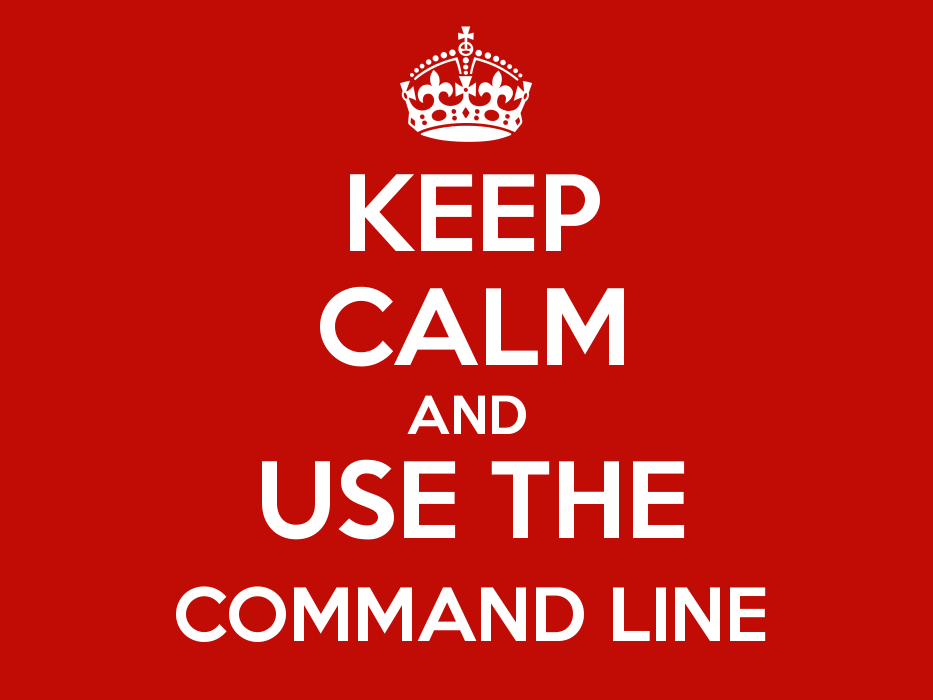

% Continuous Integration done right by leveraging Git 
% Romain Pellerin
% HumanTalks Compiègne 2016-05-10

-------------------------------------------

# I'm ONLINE

## @romainpellerin 

## [romainpellerin.eu](http://romainpellerin.eu)

### UTC, GI04 SRI

-------------------------------------------

 

GIT

On va plutot parler principalement de Git au lieu de continuous delivery.

-------------------------------------------

# Continuous

## Integration
## Delivery
## Deployment

FAIRE DESSIN

-------------------------------------------

# Online platforms

## Github

## Gitlab

## Travis-ci

FAIRE DESSIN

-------------------------------------------

Prononciation

-------------------------------------------

 

GIT != Github

- Git système de versionning (logiciel)
- Github/Gitlab : plateforme web de services, en fait des server qui host des repo git distant + features autour
- On peut utiliser Git sans github. un peu installer un repo git sur son pc et donner l'accès à d'autres gens

-------------------------------------------

Utilisez la ligne de commande (donc Linux) et pas d'outils graphiques (celui proposé par Github par ex)

-------------------------------------------

- C'est quoi Git ? Inventé par Linus Torvalds, le créateur de Linux, il y a dix ans.
- Version control system
- Remplace SVN
- Largement adopté

-------------------------------------------

# GIT =

## Directed

## Acyclic

## Graph

Fonctionne sur le principe d'un graphe orienté acyclique

-------------------------------------------

# Reminder

- Commits = snapshot
- Add : crée un hash de tous les fichiers
- Commit : crée l'identifiant qui correspond au snapshot et à l'ensemble de ces hash

-------------------------------------------

# ID =

- Content +
- Author +
- Date +
- Log message +
- Previous commit

ID unique

-------------------------------------------

# Branches

<video autoplay loop src="assets/branches.webm" ></video>

- Branches = très simple avec Git, unlike SVN
- Branches = étiquettes vers un commit
- HEAD, tags = pareil
- Tracking branches are read only
- On peut revenir à n'importe quel commit ou en annuler comme on veut

-------------------------------------------

Workflow que j'ai adopté. Il en existe d'autre. Celui-ci est répandu. A vous de choisir.

-------------------------------------------

# Pull requests

- `merge`
    - `git merge origin/feature-x`
        - `--no-ff`
        - `--ff-only`
- `rebase`
    - `git rebase origin/develop`
- `reset`
    - `git reset --hard origin/xyz`

-------------------------------------------

# Commands

- `pull` (`fetch` + `merge`)
- `bisect`
- `revert`
- `cherry-pick`

-------------------------------------------

# Thanks

### Further reading:
### [blog.romainpellerin.eu/continuous-integration.html](http://blog.romainpellerin.eu/continuous-integration.html)
### [blog.romainpellerin.eu/git-upgrade-yourself.html](http://blog.romainpellerin.eu/git-upgrade-yourself.html)

      

<!--Image credit : <a style="color: inherit" target="_blank" href="http://nvie.com/posts/a-successful-git-branching-model/">Vincent Driessen</a> & <a style="color: inherit" target="_blank" href="http://blog.osteele.com/posts/2008/05/my-git-workflow/">Oliver Steele</a>-->

-------------------------------------------

# Image/Video Credits

- [http://imgur.com/DWrI2JY](http://imgur.com/DWrI2JY)
- [http://devopsreactions.tumblr.com/post/110800328581/continuous-delivery](http://devopsreactions.tumblr.com/post/110800328581/continuous-delivery)
- Logo "Gîte de France"
- [http://xkcd.com/1597/](http://xkcd.com/1597/)
- [http://codingdomain.com/git/partial-commits/](http://codingdomain.com/git/partial-commits/
)
- [http://www.gifbin.com/983296](http://www.gifbin.com/983296)
- [http://nvie.com/posts/a-successful-git-branching-model/](http://nvie.com/posts/a-successful-git-branching-model/)

