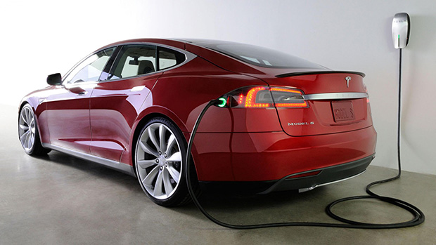
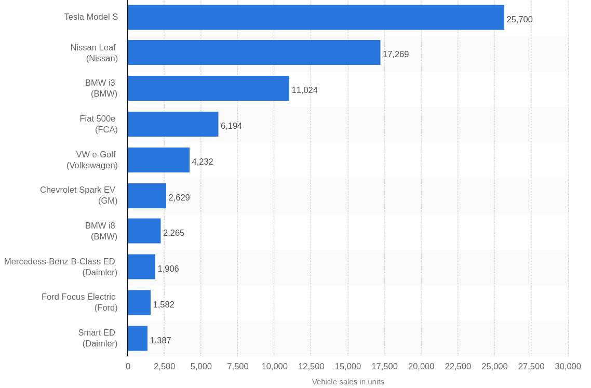
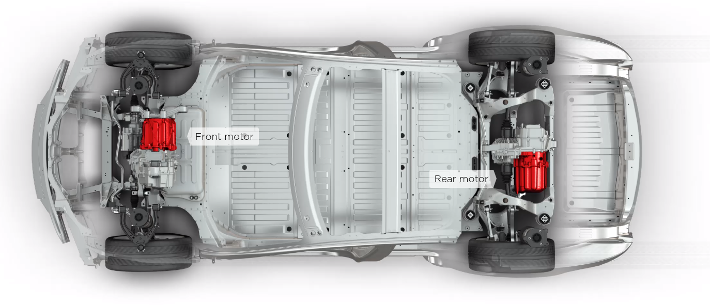
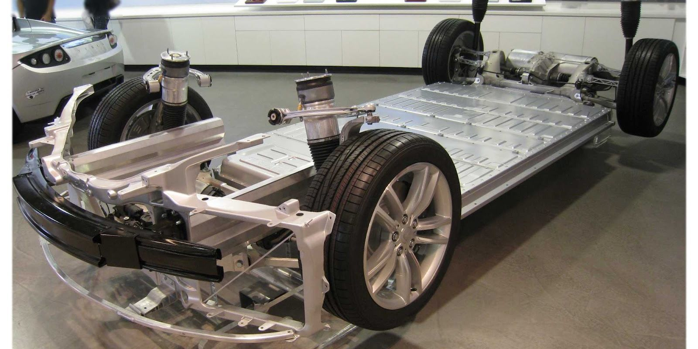

% Will ~~electric cars~~ Tesla save the world?
% Romain Pellerin
% LA15 2016-04-27

-------------------------------------------

# Contents

1. Market
2. How it works
3. Pollution & challenges
4. Expanding on Tesla

-------------------------------------------

# State of the market

* 0.1% of the 1B cars
* **Norway**: 22.5%
* **Tesla**, Nissan, BMW, Toyota
* Model S safest car ever

-------------------------------------------

## Sales (in unit) in the US in 2015

 
Source: http://www.statista.com/statistics/257966/best-selling-electric-cars-in-the-united-states/

-------------------------------------------

# How it works

### The example of Tesla's Model S

* 1 battery made of thousands of lithium-ion cells
* 1 gear
* No transmission: direct drive
* 290-kilowatt motor: 1 rotor, 1 stator

-------------------------------------------

# How it works

### The example of Tesla's Model S: chassis and motors

-------------------------------------------

# How it works

### The example of Tesla's Model S: chassis and battery

-------------------------------------------

# Challenges

- No pollution
    - Material extraction
    - Manufacturing
    - Driving & Charging
- Electricity production
    - How? Pollution?
    - Enough?
- Recyclable (battery & car)

-------------------------------------------

# Possible sources of pollution

* Making the battery (mining materials)
* Making the car
* Electricity production
* Recycling the car and **the battery**

-------------------------------------------

# Electricity production

[link](http://www.citylab.com/weather/2015/06/where-electric-vehicles-actually-cause-more-pollution-than-gas-cars/397136/)

-------------------------------------------

# Tesla's Master Plan

-------------------------------------------

# Going further 

<video autoplay loop src="assets/selfdriving.mp4" ></video>

-------------------------------------------

# Thank you

_

Q & A

-------------------------------------------

# Credits

* [http://www.plugincars.com/tesla-model-s](http://www.plugincars.com/tesla-model-s)

## Tesla Safest Car

- [http://www.consumerreports.org/cro/news/2013/05/video-the-tesla-model-s-is-our-top-scoring-car/index.htm](http://www.consumerreports.org/cro/news/2013/05/video-the-tesla-model-s-is-our-top-scoring-car/index.htm)
- [https://www.teslamotors.com/blog/tesla-model-s-achieves-best-safety-rating-any-car-ever-tested](https://www.teslamotors.com/blog/tesla-model-s-achieves-best-safety-rating-any-car-ever-tested)

