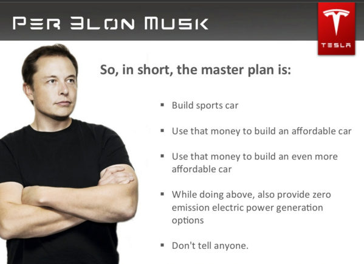
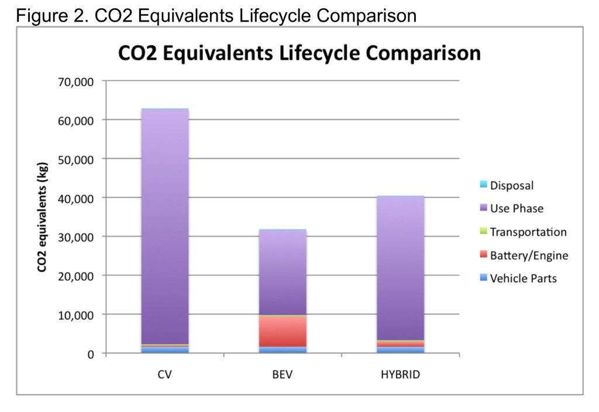
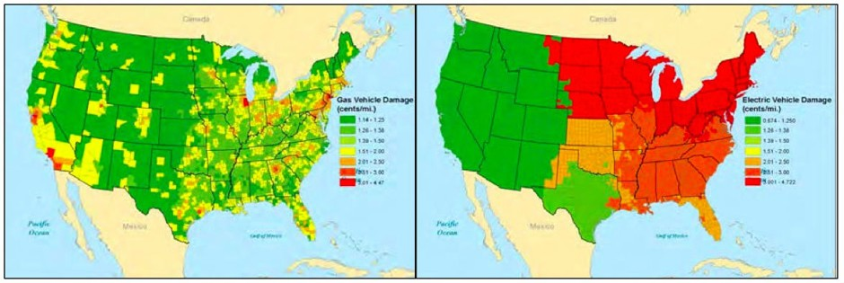

% Will ~~electric cars~~ Tesla save the world?
% Romain Pellerin
% LA15 2016-04-27

-------------------------------------------

-------------------------------------------

# Contents

1. Market
2. How it works
3. Pollution-related challenges
4. Expanding on Tesla

-------------------------------------------

# State of the market

* 0.1% of the 1B cars
* **Norway**: 22.5%
* **Tesla**, Nissan, BMW, Toyota
* Model S safest car ever

-------------------------------------------

## Sales (in unit) in the US in 2015

 
Source: [http://www.statista.com/statistics/257966/best-selling-electric-cars-in-the-united-states/](http://www.statista.com/statistics/257966/best-selling-electric-cars-in-the-united-states/)

-------------------------------------------

# How it works

### The example of Tesla's Model S

* 1 battery made of thousands of lithium-ion cells
* 1 gear
* No transmission: direct drive
* 290-kilowatt motor: 1 rotor, 1 stator

-------------------------------------------

# How it works

### The example of Tesla's Model S: chassis and motors

-------------------------------------------

# How it works

### The example of Tesla's Model S: chassis and battery

-------------------------------------------

# Challenges

- No pollution
    - Material extraction (mining)
    - Manufacturing
    - Driving & Charging
- Electricity production
    - How? Pollution?
    - Enough?
- Recyclable (battery & car)

-------------------------------------------

# CO2 emissions

 
Source: [https://simonwild.me/2013/03/05/how-to-be-green-lifecycle-impact-hybrids-are-cheaper/](https://simonwild.me/2013/03/05/how-to-be-green-lifecycle-impact-hybrids-are-cheaper/)

-------------------------------------------

# Electricity production

## Enough and green? **Solved.**

- Solar panels
- Wind power
- etc.

-------------------------------------------

# Electricity production

## BUT 

**Estimated damages for gas (left) and electric (right) cars by US country in 2015.**
Source: [http://www.citylab.com/weather/2015/06/where-electric-vehicles-actually-cause-more-pollution-than-gas-cars/397136/](http://www.citylab.com/weather/2015/06/where-electric-vehicles-actually-cause-more-pollution-than-gas-cars/397136/)

-------------------------------------------

# Going further 

<video autoplay loop src="assets/selfdriving.mp4" ></video>

-------------------------------------------

# Still reluctant?

- Auto pilot: safety++
- Range anxiety? **Free electricity at charging stations**
- No foreign oil dependency
- Quieter than engines
- Tax credits (up to $7,500)

-------------------------------------------

# Thank you

_

Q & A

-------------------------------------------

# Credits

### Intro

* [http://www.plugincars.com/tesla-model-s](http://www.plugincars.com/tesla-model-s)

### Tesla Best & Safest Car

- [http://www.consumerreports.org/cro/news/2013/05/video-the-tesla-model-s-is-our-top-scoring-car/index.htm](http://www.consumerreports.org/cro/news/2013/05/video-the-tesla-model-s-is-our-top-scoring-car/index.htm)
- [https://www.teslamotors.com/blog/tesla-model-s-achieves-best-safety-rating-any-car-ever-tested](https://www.teslamotors.com/blog/tesla-model-s-achieves-best-safety-rating-any-car-ever-tested)

-------------------------------------------

# Credits

### Pollution

- [http://www.livescience.com/52189-air-pollution-kills-millions-people-yearly.html](http://www.livescience.com/52189-air-pollution-kills-millions-people-yearly.html)
- [https://forums.teslamotors.com/forum/forums/no-rare-earth-metals-model-s](https://forums.teslamotors.com/forum/forums/no-rare-earth-metals-model-s)
- [The 2012 report](http://www.ucsusa.org/sites/default/files/legacy/assets/documents/clean_vehicles/electric-car-global-warming-emissions-report.pdf)
- [SolarCity about production](https://simonwild.me/2013/03/05/how-to-be-green-lifecycle-impact-hybrids-are-cheaper/)

### Tesla's Master Plan

- [http://www.filetrail.com/blog/2016/4/12/filetrails-master-plan-its-been-a-secret-all-along](http://www.filetrail.com/blog/2016/4/12/filetrails-master-plan-its-been-a-secret-all-along)
- [https://www.teslamotors.com/blog/secret-tesla-motors-master-plan-just-between-you-and-me](https://www.teslamotors.com/blog/secret-tesla-motors-master-plan-just-between-you-and-me)

-------------------------------------------

# Credits

### Still reluctant?

- [https://www.quora.com/How-can-Tesla-afford-to-offer-drivers-free-charging-for-life](https://www.quora.com/How-can-Tesla-afford-to-offer-drivers-free-charging-for-life)
- [http://www.engadget.com/2014/08/04/electric-cars-explainer/](http://www.engadget.com/2014/08/04/electric-cars-explainer/)

