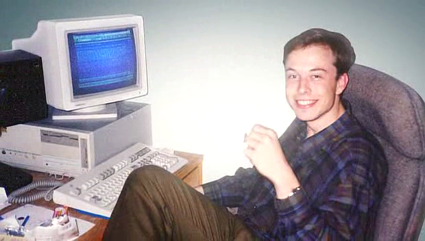
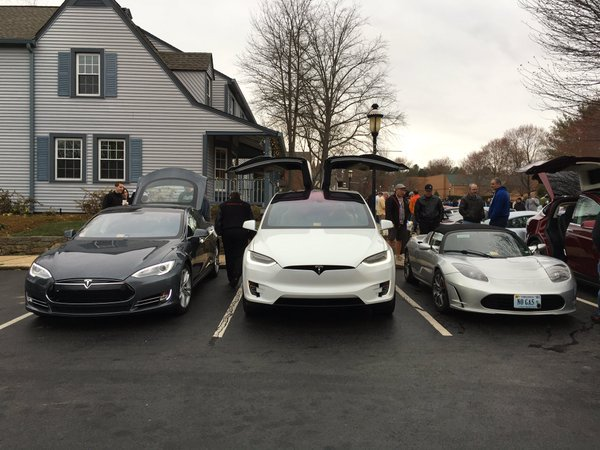

% Elon Musk
% Romain Pellerin
% SI14 2016-03-17

-------------------------------------------

-------------------------------------------

# South Africa

## Born 1971

-------------------------------------------

# The American Dream

## Flew to Canada in 1989, then to the US

* Queen's University (Ontario, Canada): undergraduate
* University of Pennsylvania (Philadelphia, US): BS in physics & BS in economics
* ...

-------------------------------------------

# The American Dream

## Flew to Canada in 1989, then to the US

* ...
* Stanford University (California, US): began a PhD in applied physics but dropped out after 2 days

-------------------------------------------

# Zip2 & Paypal

 

-------------------------------------------

# Getting down to business

## SpaceX

## Tesla

<video autoplay loop src="assets/spacex.webm" ></video>

-------------------------------------------

# Rapid Unexpected Disassembly

<video autoplay loop src="assets/RUD.mp4" ></video>

-------------------------------------------

# Being successful

<video autoplay loop src="assets/landing1.mp4" ></video>

-------------------------------------------

<video autoplay loop src="assets/landing2.mp4" ></video>

-------------------------------------------

# Tesla

<video autoplay loop src="assets/tesla.mp4" ></video>

-------------------------------------------

# Summon & Auto Pilot

<video autoplay loop src="assets/summon.mp4" ></video>

-------------------------------------------

-------------------------------------------

# What's next?

### &nbsp; 

## **SolarCity** to keep growing

## **HyperLoop** to come true

## **Mars** to be colonized

-------------------------------------------

# Thanks

Video and photo credit: Tesla & SpaceX

-------------------------------------------

# Credits

* [http://www.businessinsider.com/elon-musk-at-ignition-2013-9](http://www.businessinsider.com/elon-musk-at-ignition-2013-9)
* [http://www.elonmusk.info/1971/03/being-born.html](http://www.elonmusk.info/1971/03/being-born.html)
* [https://bizblock.wordpress.com/2015/01/04/7-reasons-why-elon-musk-is-the-craziest-ceo-of-all-time/](https://bizblock.wordpress.com/2015/01/04/7-reasons-why-elon-musk-is-the-craziest-ceo-of-all-time/)
* [https://www.youtube.com/watch?v=4_sLTe6-7SE](https://www.youtube.com/watch?v=4_sLTe6-7SE)
* [https://www.instagram.com/p/BAqirNbwEc0/](https://www.instagram.com/p/BAqirNbwEc0/)
* [https://www.youtube.com/watch?v=ANv5UfZsvZQ](https://www.youtube.com/watch?v=ANv5UfZsvZQ)
* [https://www.youtube.com/watch?v=PPQ67VVpsZs](https://www.youtube.com/watch?v=PPQ67VVpsZs)
* [https://www.youtube.com/watch?v=L2bZ1CWqvbA](https://www.youtube.com/watch?v=L2bZ1CWqvbA)
* [https://twitter.com/TeslaMotors/status/708717092460101632](https://twitter.com/TeslaMotors/status/708717092460101632)

