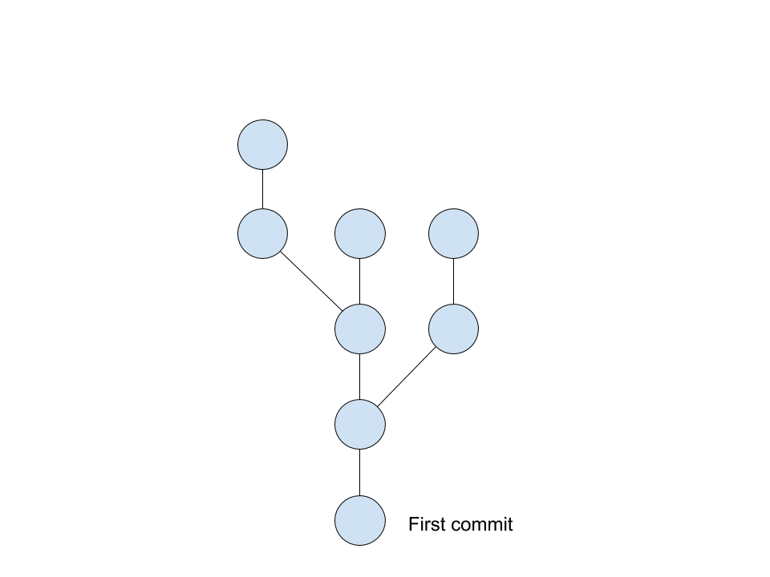
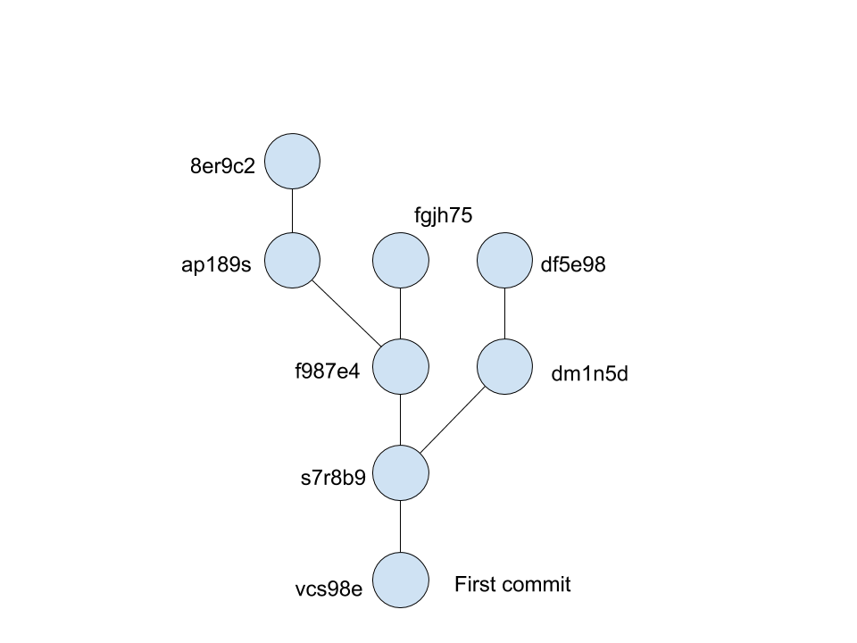
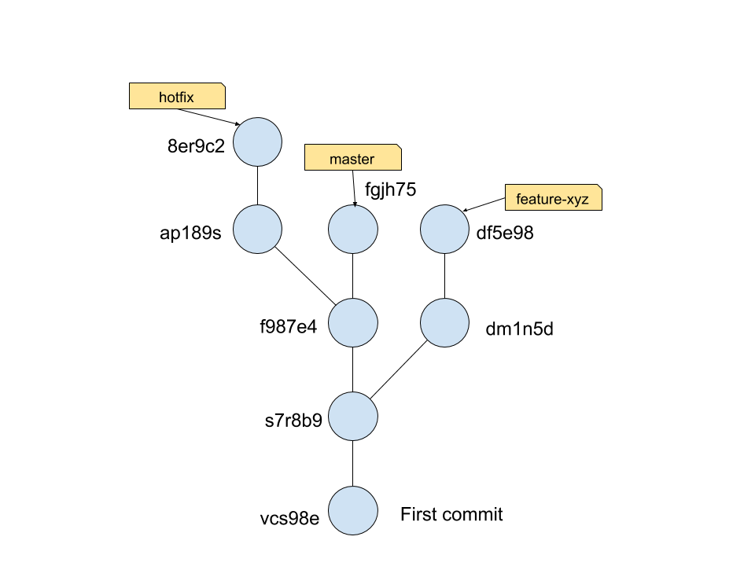
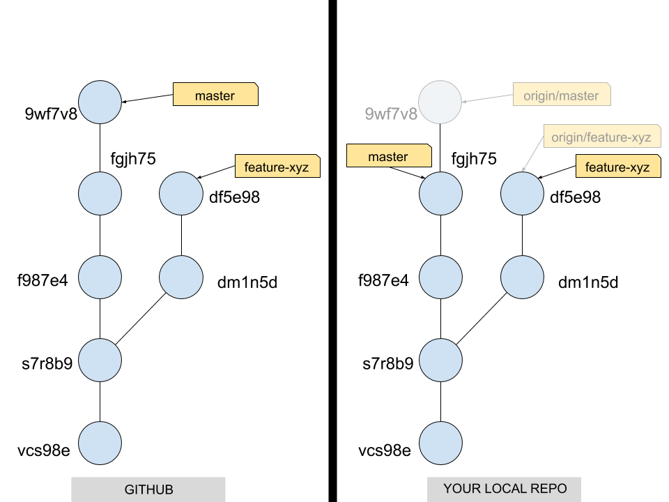
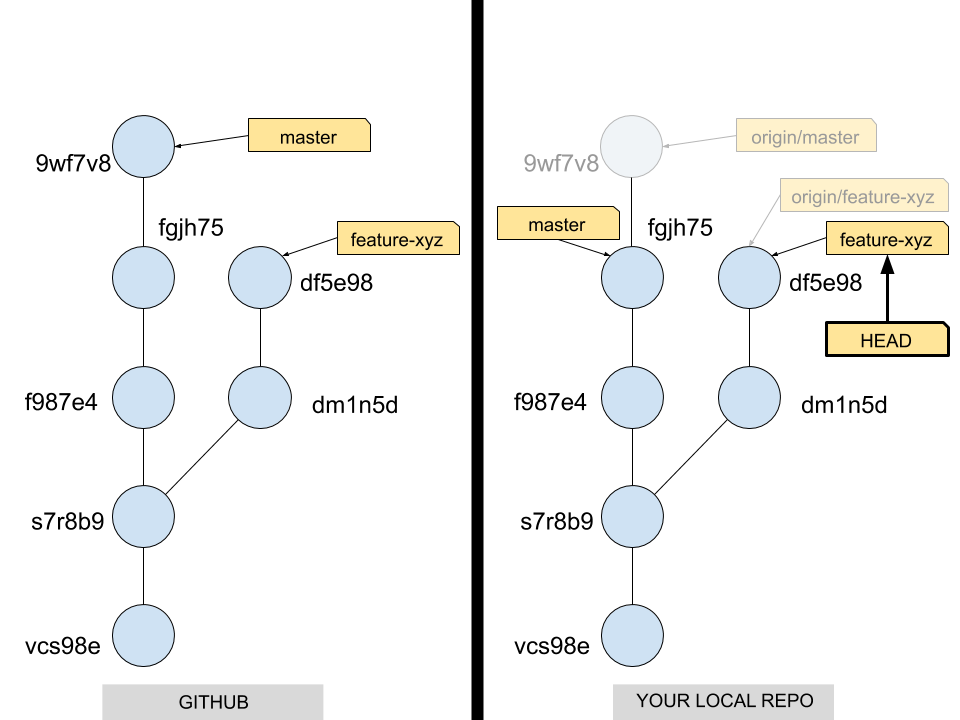
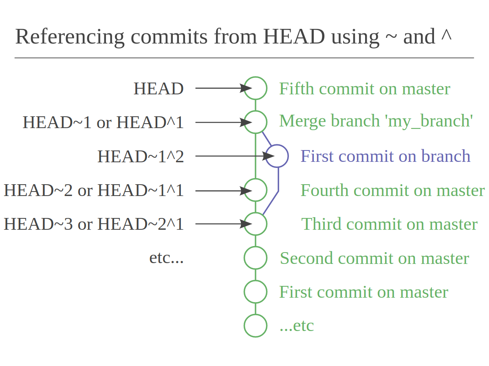
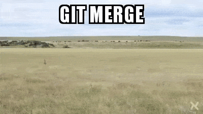
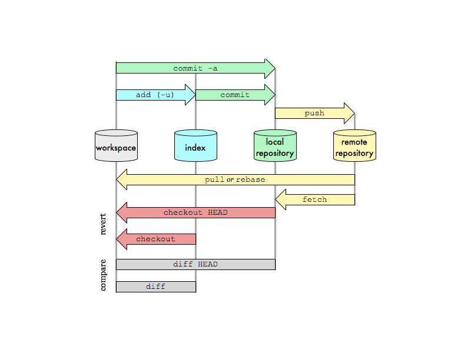
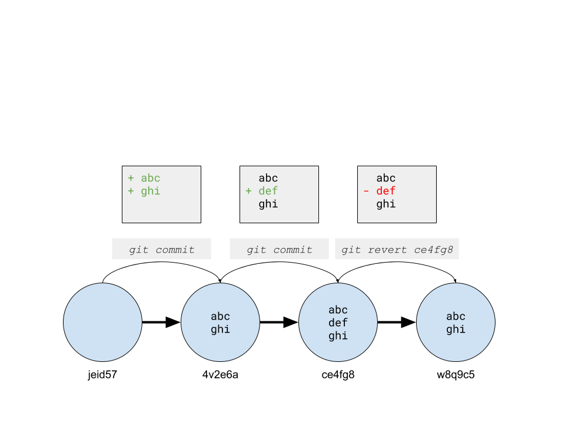
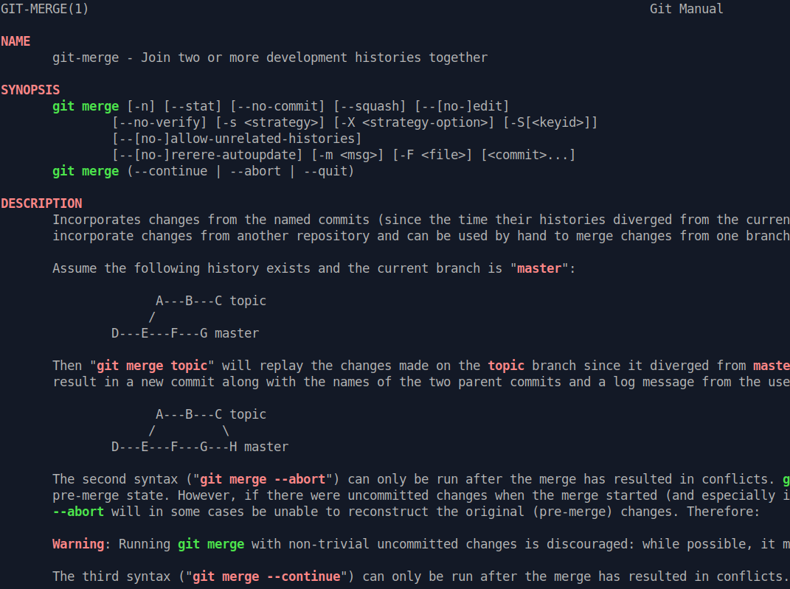

% Git: advanced concepts
% Florent Beaurain & Romain Pellerin
% Doctolib

# Outline

1. Git internals
1. _5-min break_
1. Common commands
1. _5-min break_
1. Tips and tricks for efficient programming

<br />
<br />

<!-- # In a nutshell

1. Versioning: keep every change made to files
2. Branching: develop new features while fixing bugs on a production release
3. Decentralized & Collaborative

-->


---

# Git internals

<video loop src="./assets/internals.mp4" ></video>

---

# What's Git?

## First of all, Git lives in `.git/`

---

# What's Git?

## Second of all, Git "is" a tree of commits.

---



---

# What's a commit then?

- A snapshot of the whole codebase at a given time
- This snapshot is represented as a SHA-1 hash

---

# SHA-1

SHA-1 is an algorithm that takes some data as input and generates a unique 40 character string from it.

---

# The SHA-1 hash depends on...

1. The commit message
1. The committer info
1. The commit date
1. The author info
1. The authoring date
1. The source tree (= the state of the code)
1. The commit's parent commits

<br />
If any of these values change, the SHA-1 changes.

#### [https://blog.thoughtram.io/git/2014/11/18/the-anatomy-of-a-git-commit.html](https://blog.thoughtram.io/git/2014/11/18/the-anatomy-of-a-git-commit.html)

---



---

# What's Git again?

---

# What's Git again?

1. Git holds a tree of commits

---

# What's Git again?

1. Git holds a tree of commits
2. Commits have 1 or 2 parents tops

---

# What's Git again?

1. Git holds a tree of commits
2. Commits have 1 or 2 parents tops
3. There are special cases of orphan commits (no parents) such as the first commit

---

# What's Git again?

1. Git holds a tree of commits
2. Commits have 1 or 2 parents tops
3. There are special cases of orphan commits (no parents) such as the first commit
4. **A branch is a label/tag/pointer/reference** (pick the word of your liking) **pointing towards a commit**

---



---

# Two types of branches

1. Local writable branches
2. Distant read-only branches (prefixed with _origin/_)

---



---

# Special pointers

- `HEAD`: points to the currently checked out commit
- `@`: an alias for `HEAD`

---



---

# HEAD~ vs HEAD^

#### [www.paulboxley.com/blog/2011/06/git-caret-and-tilde](http://www.paulboxley.com/blog/2011/06/git-caret-and-tilde)

- `ref~` is shorthand for `ref~1` and means the commit's first parent. `ref~2` means the commit's first parent's first parent. And so on.
- `ref^` is shorthand for `ref^1` and means the commit's first parent. But where the two differ is that `ref^2` means the commit's second parent

---



---

# Let's look under the hood

### Remember: Git lives in `.git/`

---

```bash
$ lstree .git/refs
.git/refs
     +--- remotes
     |   +--- origin
     |   |   +--- DOC-38-FIX
     |   |   +--- master
     |   |   +--- PAT-256
     |   |   +--- production
     +--- tags
     |   +--- first-commit
     +--- heads
     |   +--- master
     |   +--- feature-xyz
     |   +--- production

```

---

```bash
$ cat .git/refs/heads/master
fgjh75955bd59c7ef27d0c55b9165db6a2b768ce
```

<br />

```bash
$ cat .git/HEAD
ref: refs/heads/feature-xyz
```

Everything is a pointer pointing at a commit.

---

# Common commands



---

# How to commit?

---

# Some vocabulary first

- Workspace / working directory
- Index / staging area
- Local repository

---



---

# `git fetch`

---

# `git pull`

## `= git fetch + git merge`

---

# `git merge`

To fast forward, or not to fast forward...

---

# `git rebase`

- `git rebase origin/master`
- `git rebase -i origin/master`
- `git rebase --onto origin/master SHA-1`

Rebasing rewrites history.

---

# `git diff`

- `git diff commit1..commit2`
- `git diff commit1..`
- `git diff --staged`

---

# `git show`

- `git show SHA-1`
- `git show --stat`

---

# `git checkout`

- Create branch:<br/>**`git checkout -b feature origin/master`**
- Checkout branch:<br/>**`git checkout BRANCH`**
- Checkout files at specific revision:<br/>**`git checkout SHA-1 -- file1 file2`**

---

# `git branch`

- `git branch -vv`
- `git branch -m new-name`

---

# `git merge-base`

### `git merge-base origin/master HEAD`

<br />
==> Common ancestor between origin/master & HEAD
<br />
<br />
(= between your branch and master)

---

## `git revert <SHA-1>`

<br />
<br />
<br />
<br />
<br />



---

## `git cherry-pick <SHA-1>`

<br />

Apply changes brought by a commit.

---

# `git push`

- `git push --force`
- `git push --force-with-lease`

---

# `git stash`

- `git stash`
- `git stash pop`

---

# `git log`

- `git log -p -- package.json`
- `git log --oneline $(git merge-base @ "origin/master")..`
- `git log --stat`

# `git reset`

- Unstage files:<br />`git reset file`<br /><br />
- Move branch to other commit:<br />`git reset --hard SHA-1`

<div>


</div>

---

# `git bisect`

Finds the commit which introduced a bug.

---

# `git reflog`

History of all actions performed.

---

# Tips and tricks

## for efficient programming


---

# Use the CLI and RTFM

#### Forget about the ~~GUI~~

---

### `man git-merge`



---

### `git rebase -i $(git merge-base origin/master HEAD)`

#### When you want to edit/squash some commits and leave other untouched, while keeping most SHA-1 hashes

<div><asciinema-player loop src="./assets/rebase-base.cast" cols="113" rows="37"></asciinema-player></div>

---


---

# `git lg`

### [github.com/rpellerin/dotfiles/blob/master/.gitconfig](https://github.com/rpellerin/dotfiles/blob/master/.gitconfig)

<div><asciinema-player loop src="./assets/lg.cast" cols="113" rows="37"></asciinema-player></div>

---

### `hub pull-request`

### [github.com/github/hub](https://github.com/github/hub)

<div><asciinema-player loop src="./assets/pushn.cast" cols="113" rows="37"></asciinema-player></div>

---

# Delete merged branches

#### `git branch -r | awk '{print $1}' | egrep -v -f /dev/fd/0 <(git branch -vv | grep origin) | awk '{print $1}' | xargs git branch -D`

<div><asciinema-player loop src="./assets/delete-gone-branches.cast" cols="113" rows="37"></asciinema-player></div>

---

## Open last modified files

### [https://github.com/rpellerin/dotfiles/blob/master/.aliases](https://https://github.com/rpellerin/dotfiles/blob/master/.aliases)

<video loop src="./assets/last-files.mp4" ></video>

---

# Built-in aliases for common Git commands

### `alias | grep git`

(go ahead, run the command right now)

---

## That's it! Thanks.


