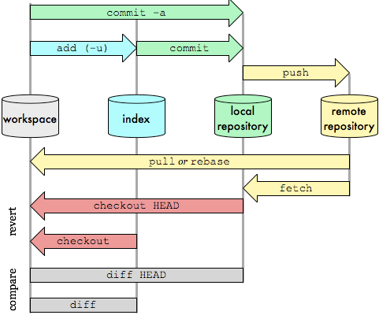

% Git: upgrade yourself
% Romain Pellerin <a target="_blank" href="https://twitter.com/romainpellerin">@romainpellerin</a>
% HumanTalks Compiègne 2015-04-14

# Versioning & Branching

1. Keep every change made to files
2. Create releases
3. Develop new features while fixing bugs on a production release


-------------------------------------------

# Decentralized & Collaborative


-------------------------------------------

# Undo

* Easily revert changes


-------------------------------------------


-------------------------------------------

# First steps #1

### Install Git (on a Debian-based OS)

```bash
$ sudo aptitude update
$ sudo aptitude install git
```

-------------------------------------------

# First steps #2
### Create an empty repository
```bash
$ mkdir project && cd project
$ git init # Create local repository
# Add a remote repository called 'origin'
$ git remote add origin git@github.com:john/project.git
```

### **OR** Clone one existing
```bash
# Clone a remote repository to a new local one
$ git clone git@github.com:john/project.git project
# Remote repo 'origin' is automatically created,
# pointing to this URL
```

-------------------------------------------

# Fundamentals


* **Workspace** (*aka* Working tree, Working directory)
* **Index** (*aka* Staging area)
* **Local repository**
* **Remote repository**

-------------------------------------------

# All you need is ~~love~~ Git



-------------------------------------------

# Common commands

## Pushing code to a remote repo

```bash
$ git status
$ git add -A # Add all the workspace to the index
$ git commit -m "Here are some commits, fellows"
$ git push origin master # Push 'master' branch to 'origin' 
```

## Pulling code from a remote repo

```bash
$ git pull origin master # Fetch and merge 'origin'
$ git log # Check what has been done
```

-------------------------------------------

# Go further

* **Branches**
    * **Create them as you need them: *master* (stable), *develop*, etc.**
    * Ready? **Merge!**
* Submodules
    * Unix philosohpy:  
      "*Write programs that do one thing and do it well*"

-------------------------------------------

# Go further

* Several remote repos
    * Production
    * Pre-prod
    * Development

## Tools

* **[Github](http://github.com/)**: contribute to Open Source projects, share yours!
* **Gitlab**: great tool to install on your own server

-------------------------------------------

# Basic workflow


-------------------------------------------

# Successful workflow


-------------------------------------------

# Keep control

* Always use **Command Line Interface**, avoid graphical tools


-------------------------------------------


[http://git-scm.com/](http://git-scm.com/)  
[https://try.github.io/](https://try.github.io/)

-------------------------------------------

# Thanks

<br /><br /><br />

[http://romainpellerin.eu](http://romainpellerin.eu)

<br /><br /><br /><br /><br /><br />

<span style="font-size: .7em; color: gray">Image credit : <a style="color: inherit" target="_blank" href="http://nvie.com/posts/a-successful-git-branching-model/">Vincent Driessen</a> & <a style="color: inherit" target="_blank" href="http://blog.osteele.com/posts/2008/05/my-git-workflow/">Oliver Steele</a></span>