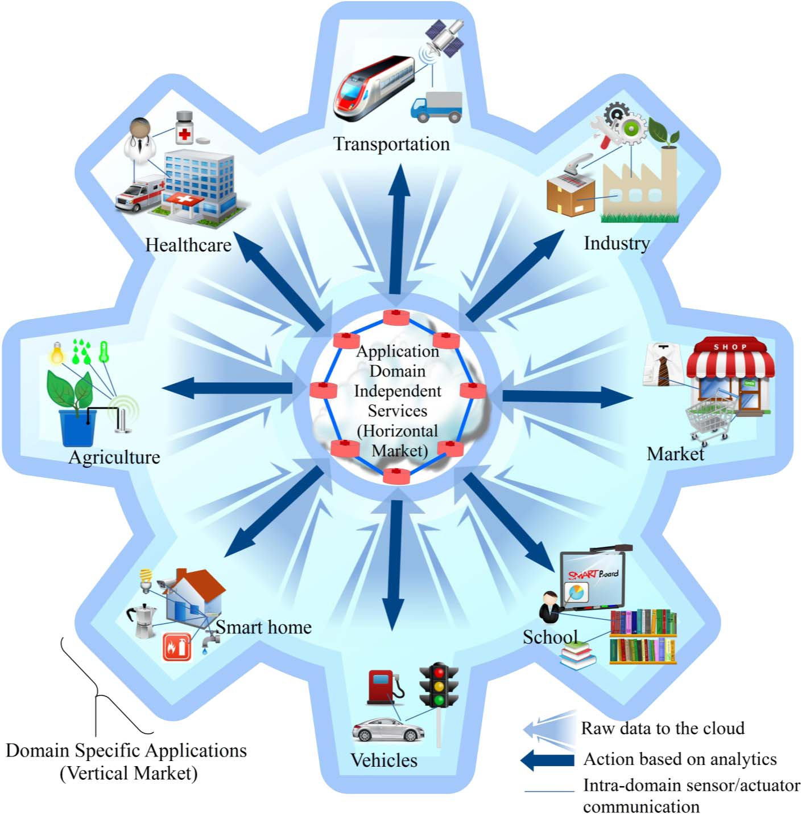
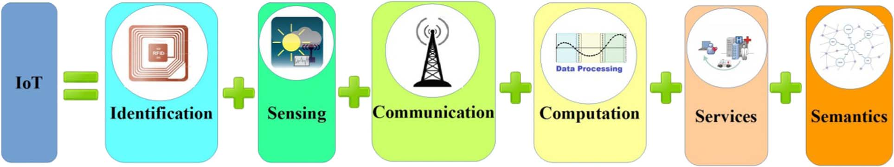
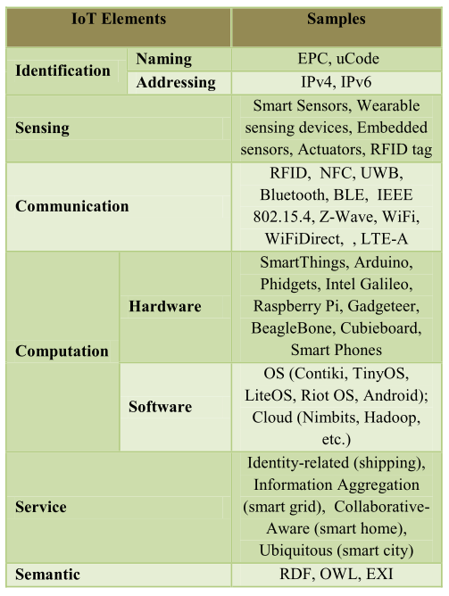
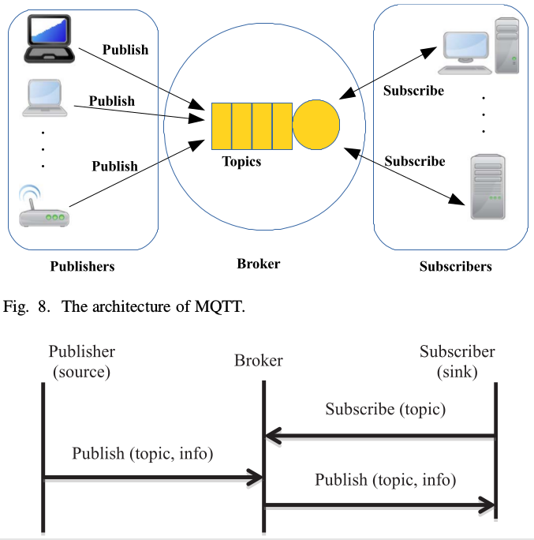
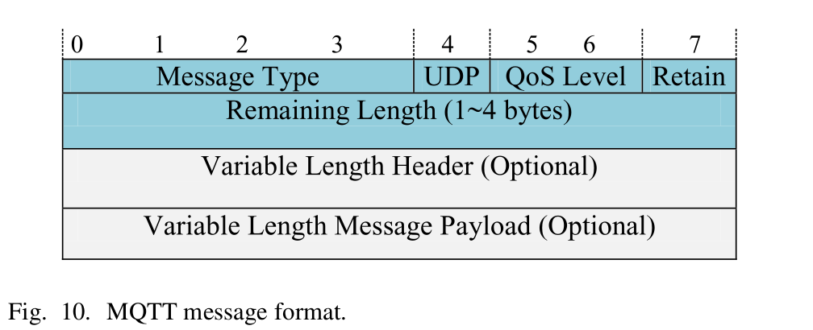
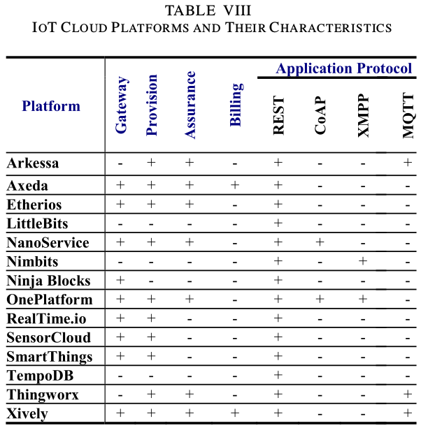
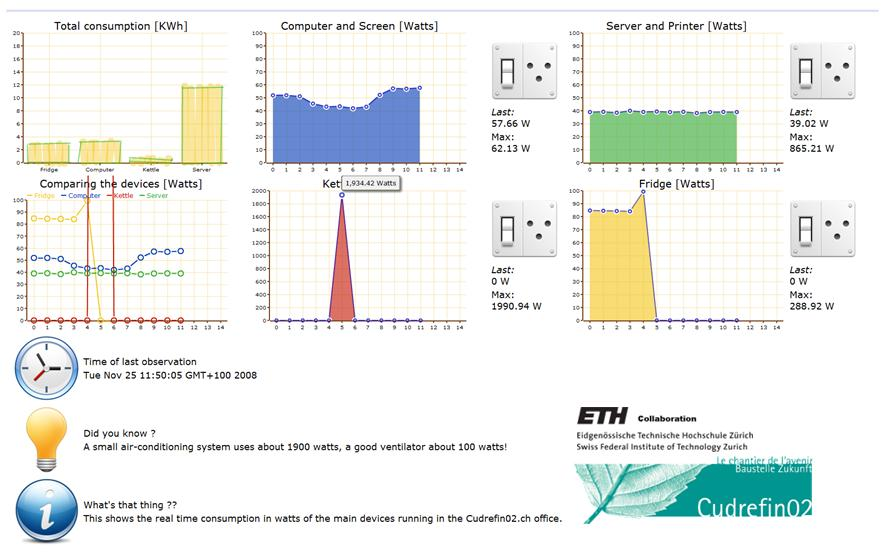
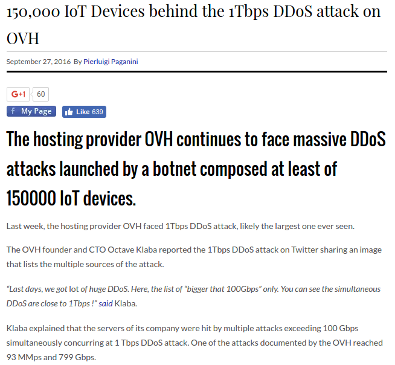

% The Internet of Things 
% Romain Pellerin
% KAIST - CS540 - 2016/11/17

-------------------------------------------

# Papers

- Internet of Things: A Survey on Enabling Technologies, Protocols, and Applications
- 5 From the Internet of Things to the Web of Things: Resource Oriented Architecture and Best Practices

<div class="pages" />

-------------------------------------------

<span style="font-size: 1.6em; color: black;">
<strong>Internet of Things:</strong> A Survey on Enabling Technologies, Protocols, and Applications
</span>

<div class="pages" />

-------------------------------------------

# Physical objects

- Thermostats
- HVAC (Heating, Ventilation, and Air Conditioning)


<div class="pages" />
<div class="notes">
- Monitoring and controlling systems = smart homes
- Improve quality of life
- From traditional to smart, they can hear thing and perfom jobs, they communicate together
</div>

-------------------------------------------



<div class="pages" />
<div class="notes">
- RFID
- Smart sensors
- Communication technologies
- Internet protocols

Picture, domain specific applications are interacting with domain independent services
</div>

-------------------------------------------

<video loop src="assets/video1.mp4" ></video>

<div class="pages" />
<div class="notes">
- Quality of life
- Home automation
- Business growth
- Many scenarios can be invented

- Challenges to be faced: communication compatibility, next slide
</div>

-------------------------------------------

# Challenges

- Internet's architectrue
- \# connected devices > Earth's human population (2010)
- IPv4 vs IPv6
- Security and privacy

<div class="pages" />

-------------------------------------------

# Market opportunity

- 212 billion entities by 2020
- 45% of Internet traffic will be M2M by 2022
- Health industry expects to sell devices
- Globally, ROI growth

<div class="pages" />
<div class="notes">
Many figures and numbers are given in the paper. The return on investment will climb up to 149% compared to only 13% in 2012. Every domain will benefit from IoT
</div>

-------------------------------------------

# IoT Architecture


<div class="pages" />
<div class="notes">
Five layers

Objects represent the physical sensors which collect and process information. Data is securely sent to the object abstraction layer which in turn forwards it to the next level using  3G, wifi, bluetooth.
The service management layer pairs a service with its requester. It is the API level.
Then application layer is the actual applicatio which provides measurements collected using the IoT devices. It is the one by which the users can interact with the devices.
Finally, the business layer managers the overall IoT system.
</div>

-------------------------------------------

# IoT Elements

<br />


<div class="pages" />
<div class="notes">
- Important to distinguish between identification (name) and addressing (usually an IP address) as identifier are not necessarly unique, the address makes it unique
- Sensing is gathering data
- Communication represent all the communication technologies that can be used (wifi, bluetooth, z-wave, LTE, RFID, etc)
- Computation means the processing units (CPU for instance, or FPGAs) and the software used for that purpose (operating systems for instance)
- Services can be categorized under four classes, depending on how advanced they are and how ubiquitous they are. Various examples are given from self driving cars to smart homes and smart healthcare.
- Finally semantics represents the brain of the IoT. It basically boils down to how to extract knowledge smartly by different machines to provide the required services.
</div>

-------------------------------------------



<div class="pages" />
<div class="notes">
- Important to distinguish between identification (name) and addressing (usually an IP address) as identifier are not necessarly unique, the address makes it unique
- Sensing is gathering data
- Communication represent all the communication technologies that can be used (wifi, bluetooth, z-wave, LTE, RFID, etc)
- Computation means the processing units (CPU for instance, or FPGAs) and the software used for that purpose (operating systems for instance)
- Services can be categorized under four classes, depending on how advanced they are and how ubiquitous they are. Various examples are given from self driving cars to smart homes and smart healthcare.
- Finally semantics represents the brain of the IoT. It basically boils down to how to extract knowledge smartly by different machines to provide the required services.
</div>

-------------------------------------------

# IoT Common Standards


<div class="pages" />
<div class="notes">
CoAP is like HTTP and Rest but it is bound to UDP. It fits really well low power devices. There is a mechanisme to provide reliable communication over UDP. As in HTTP, CoAP uses the methods GET PUT POST and DELETE.
- .next slide. Let's now talk about MQTT
</div>

-------------------------------------------

# MQTT: Message Queue Telemetry Transport

- Similar to AMQP
- **Routing mechanism**: 1-to-1, 1-to-many, many-to-many
- On top of TCP
- Optimal connection protocol for IoT and M2M (Machine to Machine)

<div class="pages" />
<div class="notes">

</div>

-------------------------------------------

# MQTT: publish/subscribe pattern 



<div class="pages" />
<div class="notes">
An interested device would register as a subscriber for specific topics in order for it to be informed by the broker when publishers publish topics of interest. The publisher acts as a generator of interesting data. After that, the publisher transmits the information to the interested entities (subscribers) through the broker.
Security is ensured by checking authorization of all the entities.
MQTT is already being used in many fields such as health care, or energy meter. Even Facebook uses it for its notification system.
</div>

-------------------------------------------

# MQTT: message format 



<div class="pages" />
<div class="notes">
As you may have understood, MQTT is well fitted for small, cheap, low power and low memory devices in vulnerable and low bandwidth networks.

Here is the message format.
The first two bytes of message are fixed header. In this format, the value of the Message Type field indicates a variety of messages including CONNECT (1), CONNACK (2), PUBLISH (3), SUBSCRIBE (8) and so on. The DUP flag indicates that the massage is duplicated and that the receiver may have received it before. Three levels of QoS for delivery assurance of Publish messages are identified by the QoS Level field. The Retain field informs the server to retain the last received Publish message and submit it to new subscribers as a first message.
</div>

-------------------------------------------

# Not covered

- XMPP: often used for messaging apps
- AMQP: similar to MQTT
- DDS: broker-less publish-subscribe architecture

<div class="pages" />

-------------------------------------------

# Comparison


<div class="pages" />
<div class="notes">
There are many ways to compare these protocols. How bad is the packet loss rate, importance of low delays, size of messages. It actually depends on what devices and what kind of network are used. There is not a unique best solution. Energy consumption can also be taken into consideration.
</div>

-------------------------------------------

# IoT Common Standards


<div class="pages" />
<div class="notes">
Let's now talk about service discovery protocols
</div>

-------------------------------------------

# Service discovery protocols

## Multicast DNS (mDNS): unicast DNS server

- flexible
- embedded Internet-based devices
    - no need for manual reconfiguration
    - run without infrastructure
    - still works if infrastructure fails

<div class="pages" />
<div class="notes">
mDNS inquires names by sending an IP multicast message to all the nodes in the local domain. By this query, the client asks devices that have the given name to reply back. When the target machine receives its name, it multicasts a response message which contains its IP address. All devices in the network that obtain the response message update their local cache using the given name and IP address.
</div>

-------------------------------------------


<div class="pages" />

-------------------------------------------

# Not covered

- DNS Service Discovery (DNS-SD): it utilizes mDNS

<div class="pages" />

-------------------------------------------

# IoT Common Standards


<div class="pages" />
<div class="notes">
Let's now talk about Infrastructure protocols
</div>

-------------------------------------------

# Infrastructure protocols

- RPL: Routing Protocol for Low Power and Lossy Networks
    - Based on IPv6
    - Destination Oriented Directed Acyclic Graph
    - 4 types of control messages used
    - 2 modes: storing & non-storing

<div class="pages" />
<div class="notes">
lire slides+
4 types of control messages are used to maintain the topology
basically nodes try to find a preferred parent
wont explain further
</div>

-------------------------------------------

# Infrastructure protocols

- Different protocols for different use cases
- Many problems pointed out
- Still a work in progress

<div class="pages" />
<div class="notes">
bluetooth, z-wave (home), wifi (home), lte (long distance), rfid (nfc)
</div>

-------------------------------------------

# IoT Common Standards


<div class="pages" />
<div class="notes">
Let's now talk about Infrastructure protocols
</div>

-------------------------------------------

# Other Influencial Protocols

- Security
    - Codo (Contiki OS)
    - IEEE 802.15.4 or IPSec
    - TLS with TCP or DTLS with UDP
- Interoperability
    - IEEE 1905.1

<div class="pages" />
<div class="notes">
Codo adds encryption
</div>

-------------------------------------------

# QoS Criteria, IoT Challenges and Future Directions

- Availability, Reliability
- Mobility, Performance
- Scalability, Interoperability
- Security, Management
- Trust

<div class="pages" />
<div class="notes">
Availability must be both software and hardware. Availability of software refers to the ability of the IoT applications to provide services for everyone at different places simultaneously. Hardware availability refers to the existence of devices all the time that are compatible with the IoT functionalities and protocols. Some easy solutions could be redundancy.

Reliability refers to the proper working of the system based on its specification. It is tigthly linked with Availability.

Mobility is more and more prominent. As we saw during previous lectures, there are still many issues to address, specifically with TCP.

Managing billions of smart devices is also another challenge, perhaps the most obvious. It is coupled with scalability, the network should be able to scale up as the number of connected devices increases. Same goes for the number of services. More importantly, all these devices and services must be interoperable. not matter what OS or hardware is used.
</div>

-------------------------------------------

<span style="font-size: 5em; color: black;">
<strong>BIG</strong> data</span>

<div class="pages" />
<div class="notes">
Connecting a large number of physical objects like humans, animals, plants, smart phones, PCs, etc. equipped with sensors to the Internet generates what is called “big data.”

Challenges: how to retrieve, store and process such amounts of data
</div>

-------------------------------------------

# Big Data

- Apache Hadoop
- SciDB

<div class="pages" />

-------------------------------------------

# Big Data: Cloud Computing



<div class="pages" />

-------------------------------------------

# Big Data: Fog Computing


<div class="pages" />

-------------------------------------------

# The Need for Better Horizontal Integration Between Application Layer Protocols

## TCP/IP vs The Rest

- Complex architecture
- Protocol translator

<div class="pages" />
<div class="notes">
IoT devices can be classified into two major categories;
namely: resource-constrained and resource-rich devices. We de-
fine resource-rich devices as those that have the hardware and
software capability to support the TCP/IP protocol suite. On de-
vices that support the TCP/IP protocol suite, IoT applications
are implemented on top of a variety of application level protocols
and frameworks including REST, CoAP, MQTT, MQTT-SN,
AMQP and others. On the other hand, devices that do not have the
required resources to support TCP/IP cannot interoperate easily
with resource-rich devices that support the TCP/IP suite. For ex-
ample, microcontroller based appliances and gadgets should
have the capability to interoperate with other IoT elements that
are TCP/IP enabled
</div>

-------------------------------------------

# Application use case


<div class="pages" />

-------------------------------------------


<div class="pages" />
<div class="notes">
we are interested in collecting the patients’
vital sign measurements and delivering it to multiple nursing
stations. We are also interested in deploying a light sensor and
a door sensor to monitor the activity level of the patients and po-
tentially identify the ones suffering from depression assuming
that the patients have private rooms.
To implement this functionality quickly, an application de-
veloper can choose the relevant SmartThings or BITalino
sensors that utilize ZigBee or Z-wave for communication to col-
lect the senor measurements on the SmartThings platforms and
utilize their APIs to build an application the pulls the collected
data to the nursing stations.
While the SmartThings approach described above can be
quickly implemented, a custom approach that utilizes Phidgets
USB sensors in conjunction with a microcontroller or processor
based Single Board Computer (SBC) can provide a better op-
tion to integrate hardware and software components from dif-
ferent providers. These sensor nodes can utilize WiFi or IEEE
802.15.4 to communicate their measurements. In this scenario,
an application developer might first download and install an open
source MQTT broker like Mosquitto. Then, an open source im-
plementation of the MQTT protocol like Eclipse Paho might be
used to implement a client that runs on the SBC associated with
the Phidgets USB sensors collecting the vital signs, light, and
door sensor data. The MQTT clients publish the sensor data to
the MQTT broker. In turn, the MQTT servers connected to the
nursing stations subscribe to the MQTT broker to fetch mes-
sages of interest. If inter-sensor collaboration is needed, a rout-
ing protocol like RPL can be utilized between the sensors to
enable the multi-hop delivery of data between sensors.
In order to allow doctors to access the collected data remotely,
a mobile application can be developed to connect to the MQTT
broker to subscribe to messages that have the topics of interest.
The broker can be publically exposed on the Internet behind a
firewall through an LTE-A connection using Cisco’s 819 M2M
Gateway.
</div>

-------------------------------------------

<span style="font-size: 1.5em; color: black;">
<strong>5 From the Internet of Things to the Web of Things</strong>: Resource Oriented Architecture and Best Practices
</span>

<div class="pages" />
<div class="notes">
They want to make the IoT part of the Internet by leveraging technologies such as HTML, Js, Ajax, PHP or ruby. This is what they call the Web of things, which is based on restful principles
</div>

-------------------------------------------

# The Web of Things

- Minimalistic web server (8KB, tiny embedded OS)
- REST = architectural style of the Web = good candidate
- Interaction through Web browsers possible (Web pages to display real-world data)

<div class="pages" />
<div class="notes">
uses URIs for identifying resources on the Web. It abstracts services in a uniform interfaces

ideal candidate to build a “universal” architecture and Application Programming
Interface (API) for smart things

JSON or XML is machine readable

For example, things can be indexed like Web pages via their
representations, users can “google” for them, and their URI can be emailed to
friends or it can be bookmarked. The physical objects themselves can become ac-
tive and publish blogs or inform each other using services, such as Twitter. 2 The
general idea is that the Web is being used as a decentralized information system
for easily exposing new services and applications, made possible, directly or indirectly, by smart things.
</div>

-------------------------------------------

# REST

- Notion of resources uniquely identified => URIs
- Allows browsing
- 1 sensor on a device = 1 resource

```bash
http://.../sunspots/1/sensors/light
```

<div class="pages" />
<div class="notes">
Resources are primarily structured hierarchically. So by accessing slash sensors, we would get the list of all the available sensors
</div>

-------------------------------------------

# Representing resources

- Operations
    - GET, PUT, POST, DELETE
- Content-negocation
    - JSON for machines
    - HTML for human beings
- Status codes

<div class="pages" />
<div class="notes">
operations or verbs add semantics

JSON is lightweight, compared to XML PAGE 7!!!!
</div>

-------------------------------------------

# Syndicating things

- Atom (GET operations)
    - Subscribe and poll from a server instead of device
    - Web hooks (push): clients must have a public URI

<div class="pages" />

-------------------------------------------

# Not covered

- Proxies
- Gateways

<div class="pages" />
<div class="notes">
In
some cases, it makes sense to hide the platform-dependent protocol to access the
resources of a particular device, and to expose them as RESTful service provided
by a gateway
</div>

-------------------------------------------

# Mashups



<div class="pages" />
<div class="notes">
In this first example, we create a mashup to help households to understand their
energy consumption and to be able to remotely monitor and control it.

The idea of the “Energie Visible” 11 project is to offer a Web dashboard that
enables people to visualize and control the energy consumption of their household
appliances

the dashboard can be im-
plemented using any Web scripting language or tool (PHP, Ruby, Python, Java-
Script, etc.).
</div>

-------------------------------------------

# Not covered

- Business Intelligence Mashup: RESTful EPCIS
- A Mashup Editor for the Smart Home
- Real-Time Web of Things: to be discussed
- Finding and Describing Smart Things
- Sharing Smart Things

<div class="pages" />

<div class="notes">
For real time, we should use other protocols RTP or RTSP, or XMPP (messaging protocol)

describing: rdf or micro formats

sharing: social media
</div>

-------------------------------------------

# Conclusion

### Problems

- HTTP adds communication overhead + increases response latency
    - Solution: caching?
- Security

### Advantages

- Simplication (same principles)
- Loose-coupling, scalability

<div class="pages" />
<div class="notes">
many libraries, available to non-programmers
</div>

-------------------------------------------

# Going further

### [blog.romainpellerin.eu/designing-an-efficient-rest-api.html](http://blog.romainpellerin.eu/designing-an-efficient-rest-api.html)

<div class="pages" />

-------------------------------------------

# The Things Network

### [thethingsnetwork.org](https://www.thethingsnetwork.org/)

<div class="pages" />

-------------------------------------------

# The Things Network

### thethingsnetwork.org

<video src="assets/things.mp4" ></video>

<div class="pages" />

-------------------------------------------

# Discussion: Hacks



<div class="pages" />

-------------------------------------------

# Discussion topics: paper 1

- What are the reasons behind why IoT architectures are different from other conventional network architectures?
    - Which architecture for what situation?
- How can we apply Content Centric Networks (CCN) to enhance identification in an IoT environment instead of IP addresses?
- Enhancing security in current IoT protocols e.g. security concerns of ZigBee

<div class="pages" />

-------------------------------------------

# Discussion topics: paper 1

- Privacy issues
- What could be the solutions to address interference, particularly looking at the fact that this is an unlicensed spectrum?
- Standardization of IoT protocols and devices? Is it possible to have a single universal application layer protocol for IoT devices and applications to talk to each other, regardless of how they are physically connected?

<div class="pages" />

-------------------------------------------

# Discussion topics: paper 2

- Isn’t converting messages to HTTP (version 1.x or 2) requests expensive?
- Complexity of security and privacy issues in the Web of Things
- Quality of Service issues
- Regulation challenges in the era of the Web of Things
- HTTP 2 instead of HTTP 1.x?

<div class="pages" />

-------------------------------------------

# Discussion topics: paper 2

- HTTP introduces communication overhead and increases average latency. How to handle this issue?
- Can we use Web of things in Local Networks(Intranet of a company)?
- Is it implemented? Do we have Web of Things nowadays? If not why?

<div class="pages" />

-------------------------------------------

# Discussion topics: paper 2

- Alternative to HTTP for real-time web of things?
- Stateless has disadvantages: can not be distributed, etc
- Can it be successfully argued that the WoT structure follows Internet design principles including e2e principle? Because it seems hardly so.

<div class="pages" />
