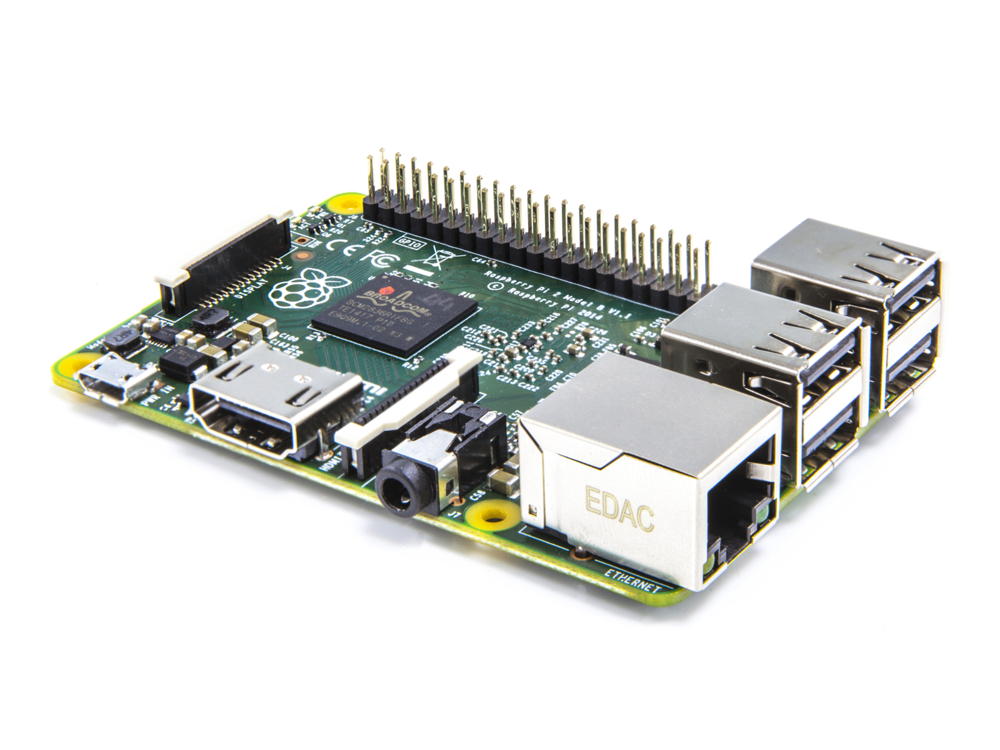

% Self-hosted services with a Raspberry Pi
% Romain Pellerin
% Hackathon UTC 2015-06-13

-------------------------------------------

# Who Am I?

GI02, UTC

[romainpellerin.eu](http://romainpellerin.eu)

[github.com/rpellerin](https://github.com/rpellerin)

[\@romainpellerin](https://twitter.com/romainpellerin)

-------------------------------------------

# Raspberry Pi 2 Model B

-------------------------------------------

# Only $35

<video loop src="assets/happy-dog.mp4" loop></video>

-------------------------------------------

# Specifications

- Micro SD card slot
- A 900MHz quad-core ARM Cortex-A7 CPU
- 1GB RAM
- 4 USB ports
- 40 GPIO pins
- Full HDMI port (1080P fully supported)
- Ethernet port 10/100 MB

-------------------------------------------

# Specifications

- Combined 3.5mm audio jack and composite video
- VideoCore IV 3D graphics core
- Camera interface (CSI)
- Display interface (DSI)

-------------------------------------------

# Raspbian (based on Debian 8)

<video loop src="assets/ingenieur-informaticien.mp4" loop></video>

-------------------------------------------

# Why self-hosting?

-------------------------------------------

# Don't rely on anyone

<video loop src="assets/hamster.mp4" loop></video>

-------------------------------------------

# Improve your skills

<video loop src="assets/bodybuilding-fail.mp4" loop></video>

-------------------------------------------

Coming soon

-------------------------------------------

# Thanks

   

[http://romainpellerin.eu](http://romainpellerin.eu)

      

<!--Image credit : <a style="color: inherit" target="_blank" href="http://nvie.com/posts/a-successful-git-branching-model/">Vincent Driessen</a> & <a style="color: inherit" target="_blank" href="http://blog.osteele.com/posts/2008/05/my-git-workflow/">Oliver Steele</a>-->